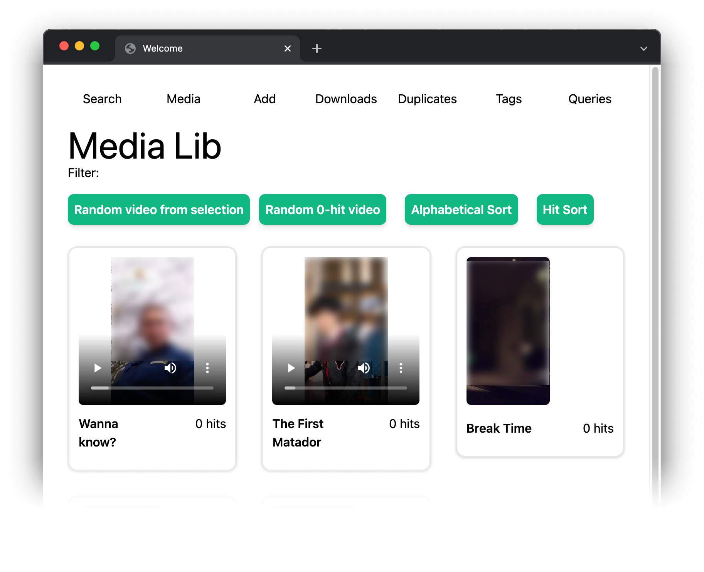

# reelchest 📦🎞️📽️ 

A basic web-based media manager. Download or upload clips, videos, or movies, and consume them from a basic web
interface.

Find duplicate videos in your library based on perceptual hashing, organize your materials using a basic tagging system,
and integrate with external search and video host adapters.

